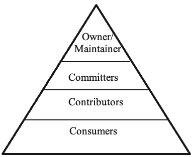
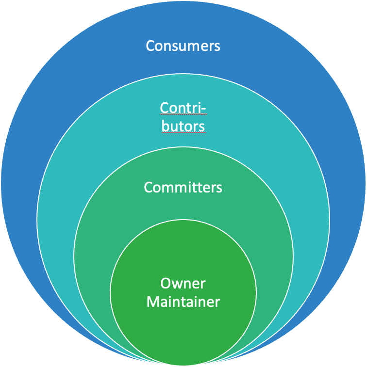

## Open Source Contributions
Contributions to open source projects can be of widely varying content, complexity and motivation. Therefore, contributions can be categorized into different classes and types to allow for providing concrete guidance for each.
In general, there are two separate classes of contributions:

1.	contributions to existing open source projects, and
2.	the creation of new projects, including open sourcing entire proprietary code bases.

These two classes differ significantly in terms of motivations, (business) reasons as well as legal considerations and practical execution. Therefore, Section 3 will cover each class separately.
Within the class of contributions to existing projects, contributions can be of very different nature, both in terms of technical complexity as well as in terms of what is being contributed. Regarding technical complexity, contributions can range from simple bug fixes (e.g., typos) to the addition of complex new features. Moreover, contributions are not limited to source code, but generally include any form of content (e.g., documentation), information (e.g., bug reports and feature requests) or support (e.g., infrastructure, marketing, release management).
Each type of contribution may require a different approach, both regarding engaging with an open source project as well as company-internal processes. Therefore, this material differentiates five types of contributions to existing open source projects:

1.	Bug reports and feature requests,
2.	Bugfixes and corrections,
3.	Supporting contributions,
4.	Individual features, and
5.	Strategic industry leading engagements.

Bug reports and feature requests: This type of contribution typically does not comprise source code, but instead is feedback to the project regarding incorrect behavior of the software, e.g., a bug report, or a request and value argumentation for a new feature. As those reports or requests typically do not comprise code (apart from potentially fractions of pseudocode), contributors fully rely on members of the development community to pick up these requests for implementation.

Bugfixes and corrections: Bugfixes are corrections of unintended and/or incorrect behavior of a software, in particular including vulnerabilities, often in response to bug reports. Bugfixes implement changes and/or additions to a code base within the scope of existing functionality. Therefore, bugfixes modify existing code, but can also add new code for handling previously unhandled scenarios or corner cases in the existing logic. Outside of such additions, bugfixes do not add new functionality to a codebase. Bugfixes are typically small in terms of the number of changed lines of code.

Supporting contributions: Supporting contributions are improvements of an open source project outside of the core functional scope of a project, but instead they are supportive in nature, aiming to improve a project’s maturity and adoption. Such contributions comprise for example:
-	improvements of a project’s documentation,
-	its build system,
-	test cases and frameworks,
-	release management,
-	code reviews, and
-	presentations

Individual features: Individual contributions address gaps in the functionality of an open source software component used in a product. This may comprise functionality for supporting industry-specific use cases, or improvements of the software to meet specific robustness and performance requirements. Therefore, the key value of closing a functional gap in an open source component is the enablement of higher-level value in the form of a better functioning product.

Strategic industry leading engagements: Strategic engagements aim to drive the evolution of open source technology of strategic relevance to a company and to establish an organization in an industry leading position in key open source projects. Strategic engagements often comprise appointing a development team to continuously make the above-mentioned types of contributions (from bugfixes to individual features) with the intention that team members take on Owner/Maintainer/Committer roles (see Section 1.3.3) in the project over time. Strategic engagements comprise both, i) projects which are hosted by open source foundations (e.g., Linux Foundation), and ii) projects created, hosted and governed by a company.

## Open Source Projects, Culture and Roles
It is important for everybody who engages in the open source ecosystem to understand its structure, culture, and social norms. This section provides a brief overview of the governance of open source projects, the purpose of open source foundations and the various roles developers within an open source project can play.

### Project Structure and Governance
The open source ecosystem is extremely heterogenous, i.e., open source projects differ greatly in terms of size of the development community, industry adoption, and governance models.
In terms of size, projects range from single-developer hobbyist activities to large scale industry driven projects such as the Linux kernel, OpenStack, or Kubernetes.

Similarly diverse is the governance structure of projects, ranging from a single developer-lead model, sometimes also referred to as “Benevolent Dictator for Life” (e.g., the Linux kernel), via company-controlled projects (e.g., Android), to fully meritocracy-based governance models (e.g., OpenStack, Kubernetes). Meritocracy refers to a governance model in which the most valued contributors to a project obtain leadership positions in the project, often based on project-wide elections. Projects controlled by a single company typically lack community-based governance fora such as Technical Steering Committees, and more prominently, all Committers (see description of developer roles in Section 1.3.3) among the developers are employed by the controlling company, thereby gatekeeping all code going into the codebase.

Additionally, the size of the development community is an indicator of the adoption of a project, but not at all a clear cut criterion. Some widely used open source projects are maintained by just a small group of developers, despite being leveraged across countless commercial and non-commercial software. Famous examples are log4j or openssl. 

Given all this diversity, organizations and developers who intend to i) utilize and consequently ii) engage in open source must be aware of the nature of the development community and take their respective ways-of-working into account.

### Open Source Foundations
Open Source Foundations are non-profit organizations which facilitate the development of open source software projects. Their goal is to establish a neutral space within which organizations – commercial or non-commercial, competing or non-competing – can jointly participate in the development of open source projects. To this end, foundations provide, among others, services such as a

1.	A vendor-neutral and meritocracy-based governance structure to ensure that no single organization steers the technical roadmap of a project and that instead project leadership positions are held by the most active and valued technical contributors,
2.	marketing and event organization to support industry adoption of a project, 
3.	development infrastructure such as cloud hosting resources and CI/CD infrastructure, and
4.	dedicated staff for handling project and release management.

Commercial and non-commercial organizations can moreover join a foundation and/or a respective project hosted by a foundation as a member. Membership typically involves a membership fee and depending on the membership level, the member organization receives different benefits, such as a seat on the governing board which oversees how the membership budget is spent.

Examples of open source foundations include the Linux Foundation, the Eclipse Foundation, the Apache Foundation, the Mozilla Foundation, and various smaller ones.

### Developer Roles
Despite the aforementioned diversity among open source projects, developers within a project typically hold one or more specific roles.

 
*Hierarchy of roles in an open source project.* 

These roles in fact exhibit a hierarchical structure as shown in Figure 1 and can be categorized as follows from bottom to top:

•	Consumers – These members of the community comprise the userbase which utilize a project in another commercial or non-commercial software. Consumers can provide valuable feedback regarding features, bug reports, and more. However, as they are not involved in the development process itself, they have little influence on how their feedback is being considered and addressed by developers.

•	Contributors – Even though everybody who provides feedback or input to an open source project effectively contributes to its development (see Consumers), the term Contributor, as used in the open source community at large, specifically refers to developers who make contributions to the content of a project, be it code or documentation. Moreover, they participate in reviewing contributions by other developers. Contributors are therefore familiar with the technical details of a project, but they are not able to submit/merge proposed code changes to the code base.

•	Committers – Developers with ability to merge new code into the repository. Therefore, they act as gate keepers. In addition, they are actively participating themselves in code development and review the contribution proposals.

•	Maintainer / Owner – Maintainers drive the vision, goals and technical architecture of the project. Depending on the size of the project, there may only be a single maintainer, for instance the original author/owner of a project, or a group of maintainers, each responsible for a specific subsystem of the code. An example for this is the Linux kernel and the maintainers of the respective subsystems. Maintainers are most deeply familiar with the code base and actively take part in code development and review.

Developers generally rise in the hierarchy of a project based on the quality of their technical contributions. Additionally, rising through the ranks requires a steady involvement in the project over an extended period of time. Moreover, even the highest level of project leadership, maintainers and owners, actively participate in code development. There is usually no such role as a non-coding architect.
