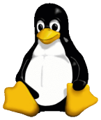
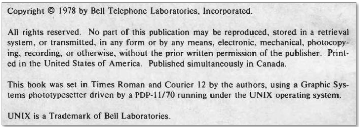
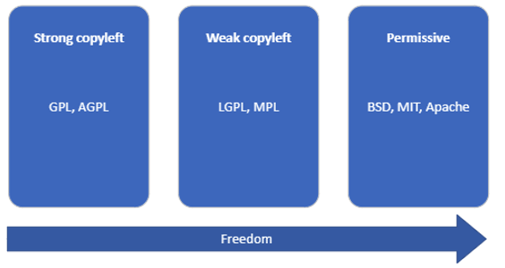

# Introduction to Free Open Source Software

Prior to the launch of the free software movement, by Richard Stallman, the GNU Project and its manifest published in 1985, software was either not considered a commodity and shared freely in the world of academia, or simply considered part of the hardware on which it was supposed to dedicatedly run.

The trigger for Richard Stallman to launch the free software movement was the increasing trend of commercial companies to only distribute software in machine code format thus preventing study and modification of the software if needed. He formalized the free software movement by founding the Free Software Foundation in 1986.

With the success of Linux, which was released by Linus Torvalds in February 1992 under the GNU Public License provided by Richard Stallman, the world is increasingly developing, publishing and consuming free open source software in an unprecedented pace all over the world and thus attracting software developers who are willing to share their efforts in return for the ability to leverage of the competence and efforts of others. Free open source software has forever changed the way we develop and implement software!

*GNU image by by Aurélio A. Heckert*, and *Tux image by [Larry Ewing](mailto:lewing@isc.tamu.edu) and The GIMP*

# Open source software in a legal context

The concept of open source software relies on the legal foundation for artistic works and the need to protect these in terms of ownership and the right to use which is covered by the copyright law. Copyright is intended to protect the original expression of an idea in the form of a creative work, but not the idea itself. Copyright is a type of intellectual property that gives its owner the exclusive right to copy, distribute, adapt, display, and perform a creative work, usually for a limited time. The copyright holder can exclusively declare such rights to apply for others.

The copyright is usually stated in the proximity of the work but applies even if not stated, which is important to remember. An example of how to state the copyright protection can be viewed in the book of The C Programming Language First Edition by Dennis Ritchie and Brian Kernighan.

Part of a copyright protected work may appear out of context. For instance, with software, a smaller piece of the source code (a.k.a code snippet) like an excellent written algorithm, may be published in a chat forum as “inspiration” for others but shall not be directly copied in a professional development.

The public domain consists of all the creative work to which no exclusive intellectual property rights apply. Those rights may have expired, been forfeited, expressly waived, or may be inapplicable. Public domain is a state and not comparable with a license, even if professional software development for simplicity should consider works in the public domain to still be made available under a very permissive license.

Moby Dick by Herman Melville was first published on October 18th, 1851. The copyright for books published in the United States before 1924 has expired why this classic book is an example of a subject in the public domain.

In the context of software development, no open source software copyright has yet expired by age and become public domain. The author of a developed software is the copyright holder, unless any separate agreement regulates the copyright ownership, and can thus decide the terms and conditions of its use, modification, and distribution. These terms and conditions are usually expressed in a license.!

# Basics of Free Open Source Software Licensing

## Licenses

The declaration of terms and conditions by the copyright holder regulating others right to use, modify and distribute the developed open source component is provided in the license text often named LICENSE. If the terms and conditions fulfill certain criteria of freedom - in brief, they allow software to be freely used, modified, shared anywhere and anytime – it is a free open source software license (FOSS). Open source software under a license not granting all freedoms isn’t a free open source software, but possibly only open source software (OSS) or source available software.

There are commonly used licenses, which after review and approval by the Open Source Initiative, are declared free open source licenses. The SPDX License list provides a comprehensive list of free open source licenses with specific unique and atomized identifiers.

Free open source software licenses vary in the freedoms they grant and the conditions they place on those freedoms. Permissive licenses grant all freedoms with minimal restrictions, usually only requiring attribution. Other licenses might require your work to be licensed under the same license as the open source software, known as copyleft licenses, and can be weak or strong. Weak copyleft licenses require derivative works of the actual open source software to be made available under the same license, while strong copyleft licenses require the ENTIRE derivative work to be released under the same license, creating a risk of loss of IPR and software design investments.

Developing with free open source software requires consideration of the various licenses involved. For instance, combining software under the Apache v2.0 and GPL v3 licenses is not allowed, as the Apache Software Foundation requires all Apache declared software to be distributed under the Apache License v2.0.

The selected and declared license for any version of a free open source software can't be retroactively changed or retracted, but the copyright holder may change the license for future releases. The copyright holder may also offer the software under dual/multiple licenses for the user of the software to choose from.

## License resources online

| Resource | Description |
| --- | --- |
| Tl;drLegal | Tl;dr means “Too long; didn’t read” and the forum provides explanations of software licenses in plain English |
| Free Software Foundation (FSF) | A non-profit organization with a worldwide mission to promote computer user freedom |
| Open Source Initiative (OSI) | A non-profit corporation with global scope formed to educate about and advocate for the benefits of open source and to build bridges among different constituencies in the open source community |
| SPDX | A Linux Foundation sponsored project with the purpose to enable efficient and reliable identification of open source licenses |

# Community development

## Forming a community of contributors

The nature of the open source licensing combined with the availability of the source code for all to explore, modify and use is what enable engagement and contribution from other developers. This is the reason why free open source software projects have multiple contributors, who contribute in various ways, such as by implementing new features, testing, fixing bugs, translation, and documentation.

The free open source movement stems from engagement and contributions from individuals and organisations with different backgrounds, motivations, reasons, expertise, and geographical locations.

The size of community for an open source project may vary over time and has typically a core of developers who together drives the project in a certain direction. Sometimes communities split over different opinions of development direction and a spin-off, or fork, appears as a new community serving the alternative development direction.

Measuring the community engagement and understanding the future development direction is important for successful professional consumption and contribution of a free open source software.

## Software repository, a community collaboration enabler

Distributed open source software development by multiple contributors benefits from a shared software repository which allows developers to incrementally submit and track enhancements/modifications to the software allowing for controlled versioning and releases of selected commits with documented changes for each release.

GitHub along with GitLab, Bitbucket, Gitea and Google Developers are platforms providing such repository service to open source projects. Platforms like these also provide metrics such as number of commits, stars and forks which can help in determining the activity and popularity of a project as illustrated by the examples of Te2zos and MongoDB:

GitHub along with GitLab, Bitbucket, Gitea and Google Developers are platforms providing such repository service to open source projects. Platforms like these also provide metrics such as number of commits, stars and forks which can help in determining the activity and popularity of a project as illustrated by the examples of Te2zos and MongoDB:

