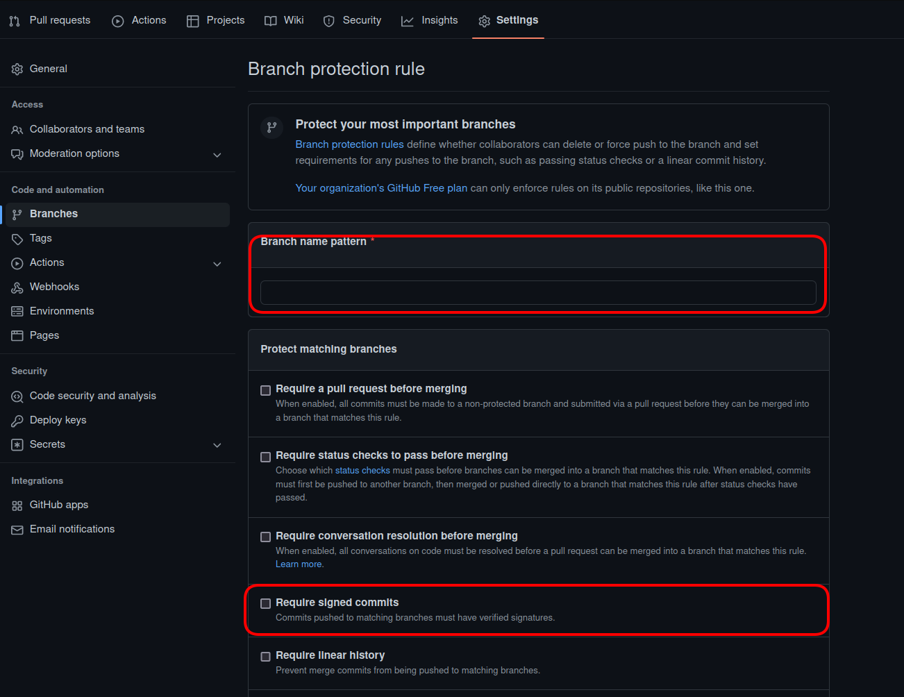

# Access Control

## _Outline_ 📋

In this chapter, we learn about

* Two-factor Authentication, or [2FA](#access-control-and-2fa), for Git repositories
* [Signing](#signing-commits) commits
* [verifying](#verifying-commits) commits
* Establishing [branch protection rules](#branch-protection-rules)

We also encourage you to explore the links throughout the text, the [Do-It-Yourself](#diy) tasks, as well as the resources listed in the [references](#references).

## Access Control and 2FA

Git is an excellent tool for source-code management. However, it does not provide access control by default. A repository may have private or public visibility, but it does not implement any authentication on its own. Access control is done to ensure that only assigned developers can read and write to it. Some [examples](https://wincent.com/wiki/Git_repository_access_control) of this include the use of `git-daemon` to provide read-only (anonymous) access, or the requirement of using SSH keys to `push` code into the repository. Users without the appropriate SSH key do not have `push` access to the repository.

Moreover, a simple step for improving the security of a repository further is to introduce Two-Factor Authentication (2FA) when logging in to a Git account. 2FA effectively requires the user to present two pieces of information to authenticate themselves (e.g., knowledge, through a password, and possession, through a phone that receives a one-time password). This raises the difficulty of compromising an account and gaining access to critical code. GitHub provides a detailed guide on how to [configure 2FA](https://docs.github.com/en/authentication/securing-your-account-with-two-factor-authentication-2fa/configuring-two-factor-authentication), or [recover](https://docs.github.com/en/authentication/securing-your-account-with-two-factor-authentication-2fa/configuring-two-factor-authentication-recovery-methods) an account. Accessing the account can be [straightforward](https://docs.github.com/en/authentication/securing-your-account-with-two-factor-authentication-2fa/accessing-github-using-two-factor-authentication) through the web, or through the command line using [SSH](https://docs.github.com/en/authentication/keeping-your-account-and-data-secure/about-authentication-to-github).

## Signing Commits

Another useful service that Git allows through the use of `SSH` keys is the possibility to `sign` code that is `pushed` to a repository. This ensures that all commits are authenticated, and the developer responsible for the code can be attributed.
In order for a commit to be signed, the `public` key must be added to the user's account; the procedure is similar to adding a key for authenticating to GitHub.


The following lines enable code signing from the command line ([instructions](https://docs.github.com/en/authentication/managing-commit-signature-verification/telling-git-about-your-signing-key)), assuming that `SSH` keys have already been created, e.g., for accessing the repository ([SSH key generation](https://docs.github.com/en/authentication/connecting-to-github-with-ssh/generating-a-new-ssh-key-and-adding-it-to-the-ssh-agent), [SSH access](https://docs.github.com/en/authentication/connecting-to-github-with-ssh/adding-a-new-ssh-key-to-your-github-account)).

```bash
git config commit.gpgsign true
git config gpg.format ssh //when using SSH key instead of GPG
git config user.signingkey "public_key"
```

More information on the proccess of signing commits can be found in the [signing commits](https://docs.github.com/en/authentication/managing-commit-signature-verification/signing-commits) section on GitHub.

## Verifying Commits

There are two ways to verify that a commit was signed with a valid key. The most straightfoward option is to visually inspect if the commit has a `Verified` icon next to it in the web interface as shown below.


For a command-line option, Git needs to be configured in order to check against the provided public keys. The file must contain at least one principal (e.g., <user1@example.com>), followed by the associated public key in a single line. The following commands show the steps required to achieve this.

```bash
git config gpg.ssh.allowedSignersFile <file>
git verify-commit -v <commit>
```

## Branch Protection Rules

Apart from restricting access to the code base, GitHub also provides protection rules that can be applied in order to restrict possible actions by unauthorized users, such as pull requests or merges. For example, GitHub allows repository administrators to require pull requests for all branches that contain the word _release_ in their name; or, that pull requests that affect other developers' code must be first approved by the code owner.

The relevant interface is shown below. More information about this proccess can be found in  [branch protection rules](https://docs.github.com/en/repositories/configuring-branches-and-merges-in-your-repository/defining-the-mergeability-of-pull-requests/managing-a-branch-protection-rule).



## DIY

### _Novice_ 👾

* Create a new GitHub repository
* Perform the following functions: clone, commit, merge, push, pull request
* Create access `SSH` keys and assign them to your GitHub account
* Create signing `SSH` or `gpg` keys and attach them to your GitHub account
* Sign a commit

### _Expert_ 💯

* Configure branch rules for your repository on GitHub to restrict access
* Set up and enable 2FA functionality in your GitHub account

<!-- ## Industry Use Cases
    The following lists outline the general knowledge that a user should have from a security perspective.
## Test Questions / Areas / Learning Goal
- Understand the difference between using HTTPS and SSH for accessing the repository
- Understand how to store and manage credentials
- What problems can static and binary analysis solve
- Has the capability to argue about properties of the cryptographic keys, e.g., the size and the cipher used
- Understands the implications and potential vulnerabilities that emerge from the choice of key properties, and storage, and 2FA options
- What type of analysis to use and when
- What guarantees does static and binary analysis provide
-->

## References

1. [Github docs](https://docs.github.com/en)
1. [Git access control examples](https://wincent.com/wiki/Git_repository_access_control)
