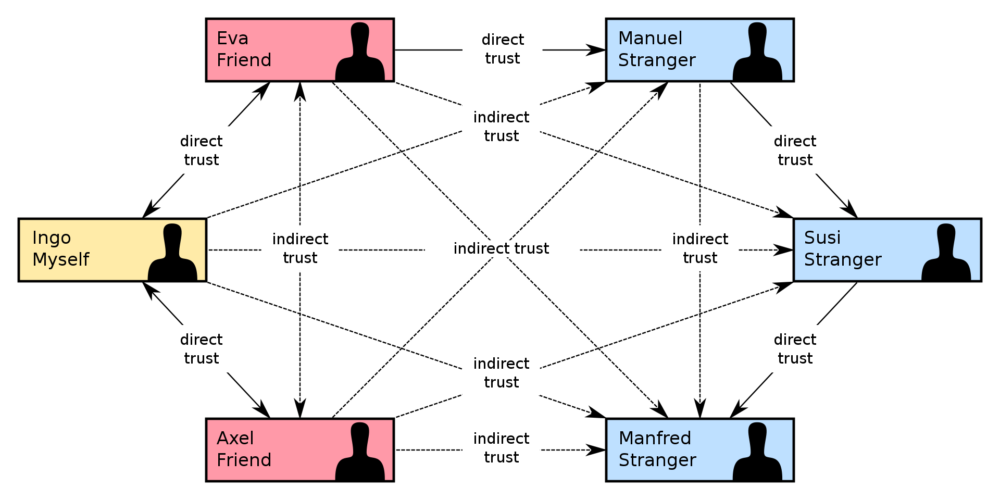

# Web of Trust

### _Outline_ 📋
In this chapter, we learn about
- What is the [Web of Trust](#web-of-trust)
- What are the [Basic Differences to PKI](#basic-differences-to-pki)
- How can we [Enter the World of Trust using GPG](#entering-the-world-of-trust-using-gpg)
  
We also encourage you to explore the links throughout the text, the [Do-It-Yourself](#diy) tasks, as well as the resources listed in the [references](#references).

## Web of Trust

In the previous section, we utilized the PKI to bind public keys to a physical entity. However, PKI is not the only option; attesting code and infrastructure can be done in another way. Following the same procedure as before: a user can distribute their public key and sign their code/work with a private key. The public key can then be used to verify that the code was submitted by the user, through their corresponding private key. The alternative to PKI, is the web of trust. The web of trust is a *decentralized* model that allows each user to endorse the association between a public key and a person; this way indirect trust can be achieved. The following image illustrates this:

 |
*Image source: https://en.wikipedia.org/wiki/Web_of_trust* |

## Basic differences to PKI

Instead of requiring a central authority to sign the user's `public` key (thus creating the certificate), the users take up the role of the Certificate Authority (CA). Because, several endorsements for a specific key needs to happen for it to be trusted (for openPGP-compliant implementations), web of trust avoids the single point of failure that exists in the PKI system; compromising a single CA would allow for the creation of bogus keys in the whole domain under this CA (including other CAs). On the other hand, it may be difficult for new users to find endorsements for their (self-signed) certificates and ultimately be able to comminicate, e.g., because they cannot physically meat other users.

## Entering the world of trust using GPG

- `gpg --gen-key` will generate a new key pair and add it into our system
- `gpg --list-keys` will list all the keys in our keyring
- `gpg --fingerprint <key>` will give us all the information for the provided key
- `gpg --import <key>` will import a key into our keyring
- `gpg --lsign-key <key>` will sign, i.e., endorse, the given key
- `gpg --check-sig <key>` will check the key against our keyring

## DIY

### _Novice_ 👾
- 

### _Expert_ 💯
- 

## References
