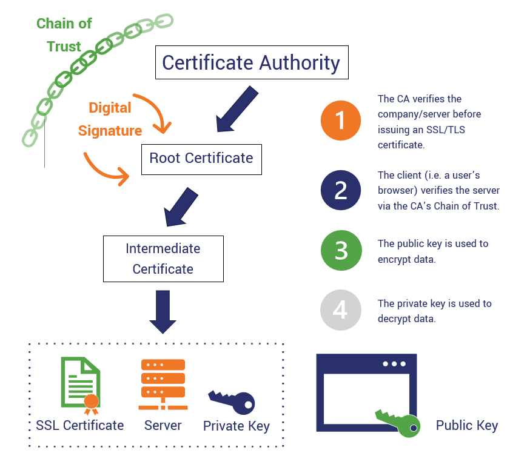

---

layout: default
title: Security in code infrastructure
nav_order: 5
description: ""
permalink: /security
---

# Security in code infrastructure

## Public Key infrastructure
Before delving into the finer details of securing the code infrastructure, we need to first discuss one of the basics components of access control and code attestation, among other things. Public Key Infrastructure (PKI) is a set of entities, with distinct roles, responsible for 
managing digital certificates; this includes, their generation, storage, distribution and most importantly revocation.

The following is a schematic of the PKI when a webpage needs to be accessed from the user's browser:

 |
|:--:|
| *Image source: https://www.thesslstore.com/blog/how-pki-works/*

PKI ensures that the `public` keys used to communicate with a server, a company, or an individual, belongs to the actual owner. As long as the certificate authority is trusted, a user can be sure that the communication happens with the intended recipient. To bring it to the context of supply chains: PKI helps ensure that the downloaded software was produced by a specific entity; it can also ensure that the code has not been changed during the lifetime of the supply chain (if signing/verification happens at each step); it can also be used to connect published code to a specific individual.  

### Public Key Encryption
The PKI also facilitates the use of assymetric encryption, known also as public key encryption (PKE). In this scheme, each user has two distinct keys; one is `public`, the other must always remain `private`. The public key can be freely distributed to the world and is required to `verify` that a piece of software was `signed` (or encrypted) by the corresponding private key. This, highlights the importance of keeping the private key secure; leaking this key would allow anyone to impersonate its actual holder. 

In the context of code infrastructure security, a compromised `private` key would allow anyone to `push` to a specific branch, `sign` the code to appear to originate from someone else, e.g., Linus Torvald, and ultimately introduce malicious code into the supply chain.

## Static analysis
`TODO: add static analysis`
## Binary analysis
`TODO: add binary analysis`
## Access control - 2FA - on the repo
The first step in securing a code repository, is to make sure that the users that can `push` changes to it are authorized to do so. 

`TODO: Generate Keys - Sign commits`

[Signing Commits (github)](https://docs.github.com/en/authentication/managing-commit-signature-verification/signing-commits)

[hide email](https://stackoverflow.com/questions/43863522/error-your-push-would-publish-a-private-email-address)

### VSCode example
[vscode-example](https://dev.to/devmount/signed-git-commits-in-vs-code-36do)

- `git config commit.gpgsign true`
- `git config user.signingkey "public_key"`

`TODO: 2FA in github`

Apart from restricting access to the code base, github also provides protection rules that can be applied in order to restrict the possible actions, e.g., pull request, merge, etc. For example, it allows repository administrators to require pull requests for all branches that contain the word `release` in their name; or, that pull requests that affect other peoples' code must be first approved by the code owner. 
[Branch protection rules](https://docs.github.com/en/repositories/configuring-branches-and-merges-in-your-repository/defining-the-mergeability-of-pull-requests/managing-a-branch-protection-rule)

## Credential Management
We already touched upon it in the first section, but improper credential management is one of the leading causes of security compromises [citation]. 

The simplest steps for credential management can be summarized as:
- Private keys must always remain secret
- 

`TODO: alternative to web of trust`

### Web of Trust
PKI is not necessarily needed  for attesting code and infrastructure. A user can distribute its public key and sign his code/work with a private key. The public key can then be used to verify the owner of the relevant code/work. 

`TODO: web of trust specifics`

## Beginner, Normal, Expert Level
## Industry Use Cases
## Test Questions / Areas / Learning Goal
## References

1. [Static analysis for security. Brian Chess, Gary McGraw](https://ieeexplore.ieee.org/stamp/stamp.jsp?arnumber=1366126)
2. [Countering trusting trust through diverse double-compiling. David A. Wheeler, 2005.](https://ieeexplore.ieee.org/document/1565233)
